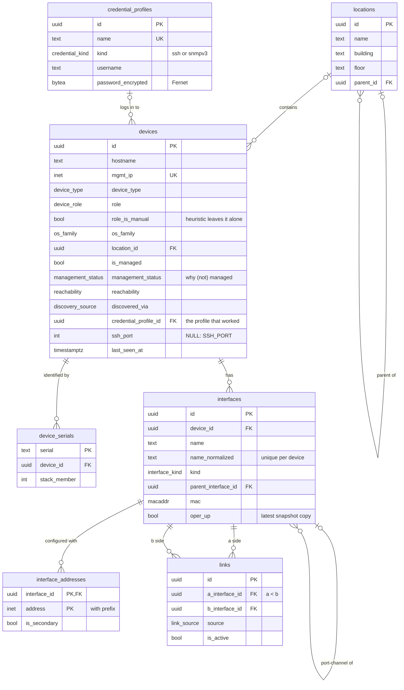
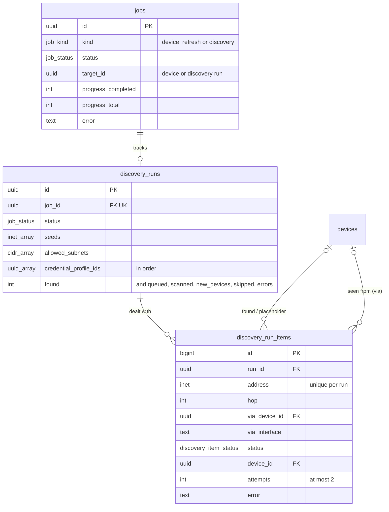
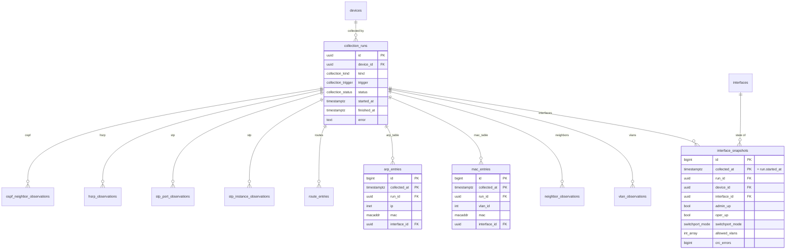
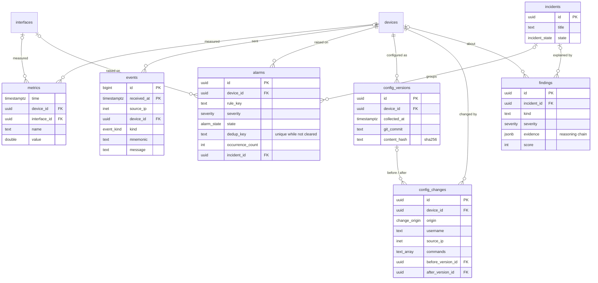

# Data model

The shared database schema used by all modules. The principles behind it, and what was left
out on purpose, are in [ADR-0002](adr/0002-data-model.md). The SQLAlchemy models in
`backend/src/netops/db/models/` are the source of truth; the diagrams show the main columns
only.

- **Entities** (regular tables) have a UUID `id` and are updated in place.
- **Observations** (TimescaleDB hypertables, kept 30 days) are append-only rows written by one
  collection run; `metrics` and `events` are hypertables kept 90 days.
- The state of device D for kind K at time T is the latest successful collection run of kind
  K for D with `started_at <= T`; use `netops.db.state` to query it.

## Inventory and topology

## Discovery runs and jobs

`topology_positions` (layer, node_id, device_id, x, y, updated_at) holds the map layout
operators saved; `node_id` is a device id or, on the L3 map, a subnet prefix.

Discovery (M1, [ADR-0005](adr/0005-discovery.md)) records one item per address it dealt
with. Devices it does not log in to (out of scope, wrong credentials, access points) are
still created as unmanaged placeholders so the map shows them; `devices.management_status`
says why.

## Collection runs and observations

Every observation row references its run with the composite foreign key
`(run_id, device_id, collected_at)` → `collection_runs (id, device_id, started_at)`, so all
rows of a run share its device and timestamp.

The other observation tables (`vlan_observations`, `neighbor_observations`,
`route_entries`, `stp_instance_observations`, `stp_port_observations`, `hsrp_observations`,
`ospf_neighbor_observations`) have the same four leading columns
(`id`, `collected_at`, `run_id`, `device_id`).

## Monitoring, configuration and diagnosis

## Tables

### Entities

| Table | Purpose |
| --- | --- |
| `locations` | Places devices live in (campus > building > floor), maintained by users. |
| `devices` | One logical device (a stack or VSS pair is one), with type, role, OS, location and reachability. |
| `device_serials` | Chassis serial numbers → device; the de-duplication key for discovery. |
| `credential_profiles` | Named SSH / SNMPv3 credentials; secrets Fernet-encrypted ([ADR-0004](adr/0004-credentials-and-device-access.md)). |
| `interfaces` | Device interfaces by normalized name, with port-channel membership and the latest known state. |
| `interface_addresses` | IP addresses (with prefix) configured on interfaces; used for subnet → gateway lookups. |
| `links` | Physical links between two interfaces, stored once (a < b), from CDP/LLDP, inference or manual entry; inactive once no longer reported. |
| `jobs` | Long-running operations started through the API (device refresh, discovery): status, progress, error. |
| `discovery_runs` | One discovery run: seeds, allowed subnets, credential profiles, progress counters. |
| `topology_positions` | Saved node positions of the topology map per layer (one global layout until M7). |
| `discovery_run_items` | What a run did with each address: discovered, duplicate, auth_failed, unreachable, out_of_scope, unsupported_platform, no_mgmt_ip. |
| `collection_runs` | One row per collector execution: device, kind, trigger, status and timing; defines point-in-time state. |
| `alarms` | Problems with a lifecycle (open → acknowledged → cleared), deduplicated per `dedup_key`. |
| `incidents` | Groups of alarms attributed to one root cause by M6. |
| `config_versions` | Distinct device configurations: Git commit, normalized-content hash, size (text is in Git). |
| `config_changes` | Configuration changes made through the platform or outside it, with user, source IP and commands. |
| `findings` | Diagnosis results: root-cause candidates with explanation, evidence chain and score. |

### Observations (hypertables)

| Table | Written by run kind | Purpose |
| --- | --- | --- |
| `interface_snapshots` | `interfaces` | Per-interface status, speed/duplex, switchport mode and VLANs, error counters. |
| `vlan_observations` | `vlans` | VLANs defined on the device and their status. |
| `neighbor_observations` | `neighbors` | CDP/LLDP neighbours per local interface; links are derived from them. |
| `mac_entries` | `mac_table` | MAC address table: MAC → port per VLAN (host finder). |
| `arp_entries` | `arp_table` | ARP table: IP → MAC per interface (host finder). |
| `route_entries` | `routes` | Routing table, one row per next hop (L3 path tracing). |
| `stp_instance_observations` | `stp` | Per-VLAN spanning-tree root, root port, cost and topology-change count. |
| `stp_port_observations` | `stp` | Per-VLAN spanning-tree role and state of each port. |
| `hsrp_observations` | `hsrp` | HSRP groups: virtual IP, state, priority, active and standby routers. |
| `ospf_neighbor_observations` | `ospf` | OSPF adjacencies: neighbour router ID, address, interface, area, state. |
| `metrics` | (SNMP poller) | Narrow time series: one numeric sample per device/interface, metric name and time. |
| `events` | (syslog/trap receiver) | Raw syslog messages and SNMP traps with parsed fields. |

Run kinds `facts` and `config` write no observation table: `facts` updates `devices` and
`device_serials`; `config` writes `config_versions` when the configuration changed.

Which commands each kind runs, and which of them are required, is defined in
`backend/src/netops/inventory/collectors.py`.

### Names used in the proposal

| Proposal (section 6.4) | Here |
| --- | --- |
| `snapshot_id` | `collection_runs.id` (`run_id` on observations) |
| `vlans`, `stp_ports` | `vlan_observations`, `stp_instance_observations`, `stp_port_observations` |
| `routes`, `hsrp_groups` | `route_entries`, `hsrp_observations` |
| `svis` | `interfaces` with `kind = 'svi'` plus `interface_addresses` |
| `changes` | `config_changes` |
| `users`, `credentials`, `audit_log` | deferred to M7 |
